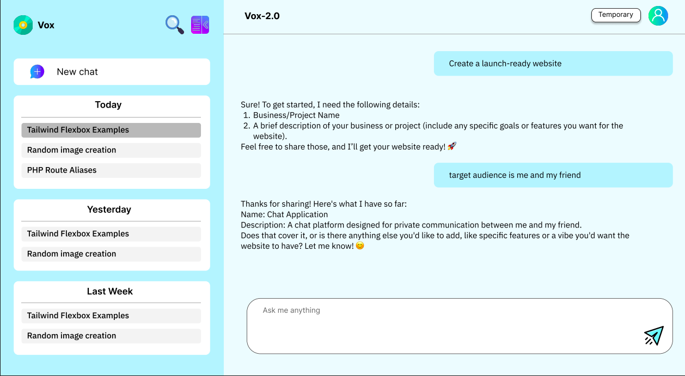

# 🧠 Vox AI — Your Intelligent AI Chat Assistant

> **Vox AI** is a polished, production-ready chat application powered by **Google Gemini** and built with modern technologies including **Next.js**, **TypeScript**, **Redux**, **PostgreSQL**, **JWT** and **Tailwind CSS**. It's designed for speed, responsiveness, and an engaging user experience — ideal for real-time AI interaction and natural conversation flow.

---

Login Credentials:
Email: tarequemahmud313@gmail.com
password:aaaaaa

---

## 📌 Table of Contents

- [About](#about)
- [Features](#features)
- [Screenshots](#screenshots)
- [Tech Stack](#tech-stack)
- [Project Structure](#project-structure)
- [Getting Started](#getting-started)
- [Deployment](#deployment)
- [Future Plans](#future-plans)
- [License](#license)

---

<a id="about"></a>

## 🚀 About

**Vox AI** is inspired from modern ChatGPT-like interface, delivering seamless and contextual conversations with an intelligent assistant. The app leverages **Google Gemini 2.0 Flash** for real-time NLP responses, structured through clean routing, streaming response and styled with responsive Tailwind components.

---

<a id="features"></a>

## ✨ Features

- 💬 **Conversational AI Interface**  
  Powered by **Gemini 2.0 Flash** which is smarter in response .

- 🔐 **Advanced Authentication System**  
  Includes OTP-based registration, password recovery, and **jwt** based secure session management. Utilizes **Redis** for caching and fast token validation.

- ⚡ **Real-Time Chat UX**  
  Typing simulation and quick response rendering for a human-like interaction.

- 🧠 **Context-Aware Messaging**  
  Uses history management with help of **Redux** and **PostgreSQL** database and additional functionalities to send history to the model and enable context aware messaging.

- 🧠 **Streamed Response**  
  Uses **Redux Toolkit** and **ReadableSream** api to stream the response from the model.

- 📝 **Title Prediction**  
  Automatically generates a chat title based on the first message.

- 🔍 **Search Messages**  
  Enables users to search through chat history for specific keywords or phrases, leveraging PostgreSQL full-text search capabilities.

- 🌐 **Dynamic Routing**  
  Chat sessions stored via clean URL slugs `/chat/[chatId]`.

- 📱 **Responsive Design**
  UI for both desktop and mobile using **Tailwind CSS** — pixel-perfect across all devices.

- 📔️ **PostgreSQL**
  Backend-ready for persistent chat history using **PostgreSQL** or any SQL-based DB.

- 📦 **Serverless Architecture**  
  API routes via **Next.js App Router** — zero Express or custom servers needed.

---

<a id="screenshots"></a>

## 📸 Screenshots



---

<a id="tech-stack"></a>

## 💪 Tech Stack

| Layer                | Technology                          |
| -------------------- | ----------------------------------- |
| **Framework**        | Next.js 15 (App Router)             |
| **Language**         | TypeScript                          |
| **AI Engine**        | Google Gemini API                   |
| **Styling**          | Tailwind CSS                        |
| **State Management** | Redux Toolkit                       |
| **Backend**          | Next.js API Routes                  |
| **Database**         | PostgreSQL with node-pg library     |
| **Hosting**          | Vercel(Docker Enabled for Dev mode) |
| **Database Hosting** | Supabase                            |
| **Authentication**   | JWT, Redis(for otp caching)         |

---

<a id="project-structure"></a>

## 🧹 Project Structure

```bash
# 📦 Root

├── Dockerfile
├── .dockerignore
├── docker-compose.yml
├── docker-compose.override.yml
├── .env
├── .gitignore
├── next.config.ts
├── next-env.d.ts
├── package.json
├── package-lock.json
├── postcss.config.mjs
├── eslint.config.mjs
├── tsconfig.json
├── README.md

# 🖼️ Public assets

├── public/
│ ├── logo.png
│ ├── new-chat.png
│ ├── send.png

# 💡 Application Source
└── src/
    ├── app/                         # Next.js app directory (routes + layout)
    │   ├── globals.css
    │   ├── icon.png

    │   # 🔐 Auth Pages & Layout
    │   ├── auth/
    │   │   ├── layout.tsx
    │   │   ├── login/
    │   │   │   └── page.tsx
    │   │   ├── register/
    │   │   │   └── page.tsx
    │   │   └── recover/
    │   │       └── page.tsx

    │   # 🏠 Home + Chat UI Routes
    │   ├── (home)/
    │   │   ├── layout.tsx
    │   │   ├── page.tsx
    │   │   └── chat/
    │   │       ├── page.tsx
    │   │       └── [id]/
    │   │           └── page.tsx

    │   # ⚙️ API Routes — backend logic (handled by Next.js)
    │   ├── api/
    │   │   ├── auth/                 # Auth APIs
    │   │   │   ├── login/
    │   │   │   │   └── route.ts
    │   │   │   ├── register/
    │   │   │   │   └── route.ts
    │   │   │   ├── verify/
    │   │   │   │   └── route.ts
    │   │   │   └── recover/          # Recovery-related
    │   │   │       ├── find-email/
    │   │   │       │   └── route.ts
    │   │   │       ├── verify-otp/
    │   │   │       │   └── route.ts
    │   │   │       └── change-password/
    │   │   │           └── route.ts
    │   │   ├── askgemini/           # Gemini AI route
    │   │   │   └── route.ts
    │   │   ├── chats/               # Chat management
    │   │   │   ├── route.ts
    │   │   │   └── [chatId]/
    │   │   │       └── messages/
    │   │   │           └── route.ts
    │   │   └── seed/                # DB Seeder
    │   │       └── route.ts

    # ⚙️ Shared logic (hooks, context, store, utils)
    ├── hooks/
    │   ├── reduxHooks.tsx
    │   └── useLoader.ts

    ├── contexts/
    │   └── AlertContext.tsx

    ├── lib/                         # Business logic, utilities, store
    │   ├── askgemini.ts
    │   ├── auth.ts
    │   ├── axios.ts
    │   ├── db.ts
    │   ├── generateHistory.ts
    │   ├── insertMessage.ts
    │   ├── mailer.ts
    │   ├── predictTitle.ts
    │   ├── recoveryToken.ts
    │   ├── redis.ts
    │   ├── sendOTP.ts
    │   ├── store.ts
    │   ├── verifyOTP.ts
    │   └── features/
    │       └── chat/
    │           └── chatSlice.ts
    │

    # 🧩 Reusable UI components
    ├── components/
    │   ├── AlertBar.tsx
    │   ├── AuthLinks.tsx
    │   ├── ChatlistContainer.tsx
    │   ├── ChatShower.tsx
    │   ├── ClientLayout.tsx
    │   ├── HomeClientLayout.tsx
    │   ├── Logo.tsx
    │   ├── MarkdownResponse.tsx
    │   ├── NewChatButton.tsx
    │   ├── Spinner.tsx
    │   ├── StoreProvider.tsx
    │   └── TextPad.tsx

    # 🧾 Typescript types
    └── types/
        ├── auth.d.ts
        ├── chat.d.ts
        └── misc.d.ts
```

---

<a id="getting-started"></a>

## ⚠️ Getting Started

### 1. Clone the Repo

```bash
git https://github.com/TarequeMahmud/vox.git
cd vox
```

### 2. Add Environment Variables

Create a `.env` file in the root with the following:

```env
# Google Gemini API Key
GEMINI_API_KEY=<your-gemini-api-key>

# JWT Secret Key for authentication
JWT_SECRET_KEY=<your-jwt-secret-key>

# Node environment (development/production)
NODE_ENV=development

# Disable TLS certificate validation
NODE_TLS_REJECT_UNAUTHORIZED='0'

# SMTP Configuration for email services
SMTP_HOST="smtp.ethereal.email"
SMTP_USER=<your-smtp-user>
SMTP_PASS=<your-smtp-password>

# Redis URL for caching
REDIS_URL="redis://<your-redis-url>"

# PostgreSQL Database URL
POSTGRES_URL="postgres://<your-postgres-url>"
```

> Replace `<your-...>` placeholders with your actual credentials.
> Ensure this file is not exposed in public repositories.

---

### 3. Start the App with Docker

Run the following to build and start the dev server:

```bash
docker compose up --build
```

The app will be available at:

🌐 `http://localhost:3000`

---

## 🐳 Docker Setup

### Dockerfile

```Dockerfile
FROM node:18-alpine

RUN apk add --no-cache libc6-compat curl

WORKDIR /app

COPY . .

RUN npm install

EXPOSE 3000

CMD ["npm", "run", "dev"]
```

### docker-compose.yml

```yaml
services:
  vox:
    image: custom-next-app:latest
```

### docker-compose.override.yml

```yaml
services:
  vox:
    image: custom-next-app:latest
    build: .
    ports:
      - "3000:3000"
    healthcheck:
      test: ["CMD-SHELL", "curl -f http://localhost:3000 || exit 1"]
      interval: 1m30s
      timeout: 10s
      retries: 3
      start_period: 40s
    develop:
      watch:
        - action: sync
          path: .
          target: /app
          ignore:
            - node_modules/
        - action: rebuild
          path: package.json
```

---

## 🥪 PostgreSQL Integration

To persist chats:

- You can use **Supabase**, **Railway**, or a local PostgreSQL instance.
- This project uses **Supabase** PostgreSQL.
- When using the `POSTGRES_URL`, it's recommended to remove `?sslmode=require` or to use `NODE_TLS_REJECT_UNAUTHORIZED='0'` in `.env` to avoid **Node.js signature verification** errors.

### ✅ Seeding Tables (If not creating tables manually)

You can create and seed basic tables like `users`, `chats`, and `messages` by running the seed script found in [`app/seed/route.ts`](./src/app/seed/route.ts).

To enable seeding, **uncomment the following function calls** in the `GET` method of the seed route:

```ts
export async function GET() {
  // Call the seedUsers function
  console.log("Seeding tables...");

  try {
    //await seedUsers();
    //await seedChats();
    //await seedMessages();
    return NextResponse.json({
      message: "Seeding Complete",
    });
  } catch (error) {
    console.error("Error seeding:", error);
    return NextResponse.json({
      response: "Seeding failed",
      message:
        error instanceof Error
          ? error.message
          : "Seeding failed with unknown error",
    });
  }
}
```

Each function will:

- **`seedUsers()`**
  Create the `users` table and add a sample user (`aaa@aa.a`, password: `aaaaaa`).

- **`seedChats()`**
  Create the `chats` table, linked to users.

- **`seedMessages()`**
  Create the `messages` table, linked to chats and users.

Once uncommented, run the seed script by visiting:

```
http://localhost:3000/seed
```

A response of `{ "message": "Seeding Complete" }` indicates success.

### ✅ Creating Tables Manually (If Not Seeding)

If you prefer to create the tables manually instead of using the seed script, here are the SQL commands for the required tables:

#### Users Table

```sql
 CREATE TABLE IF NOT EXISTS users (
    id UUID PRIMARY KEY,
    name VARCHAR(100) NOT NULL,
    email VARCHAR(100) UNIQUE NOT NULL,
    password VARCHAR(255) NOT NULL,
    created_at TIMESTAMP DEFAULT NOW()
);
```

#### Chats Table

```sql
CREATE TABLE IF NOT EXISTS chats (
    id UUID PRIMARY KEY DEFAULT gen_random_uuid(),
    user_id UUID REFERENCES users(id),
    title VARCHAR(100) NOT NULL,
    created_at TIMESTAMP DEFAULT NOW(),
    updated_at TIMESTAMP DEFAULT NOW()
);
```

#### Messages Table

```sql
CREATE TABLE IF NOT EXISTS messages (
    sequence  SERIAL PRIMARY KEY,
    id UUID UNIQUE DEFAULT gen_random_uuid(),
    chat_id UUID REFERENCES chats(id),
    user_id UUID REFERENCES users(id),
    content TEXT NOT NULL,
    role VARCHAR(10) NOT NULL CHECK (role IN ('user', 'model')),
    created_at TIMESTAMP DEFAULT NOW(),
    updated_at TIMESTAMP DEFAULT NOW()
);
```

> Ensure your PostgreSQL instance is running and connected to the app using the `POSTGRES_URL` in the `.env` file.

Once the tables are created, the app will automatically interact with them for storing and retrieving data.
You can create database

## 🐏 Redis Setup

To enable caching and fast token validation, configure Redis:

1. Add the `REDIS_URL` in your `.env` file:

```env
# Redis URL for caching
REDIS_URL="redis://<your-redis-url>"
```

> Replace `<your-redis-url>` with your actual Redis connection string.

2. Ensure Redis is running locally or use a cloud provider like **Redis Cloud**.

3. Test the connection by looking on server console for the the following script:

```ts
import { createClient } from "redis";

const client = createClient({ url: process.env.REDIS_URL });

client.on("error", (err) => console.log("Redis Client Error", err));

if (!client.isOpen) {
  console.log("Connecting to Redis...");
  client.connect();
} else {
  console.log("Redis is already connected");
}

export default client;
```

4. Redis is now ready for use in caching and session management.

---

<a id="deployment"></a>

## 🚀 Deployment

### Production: Vercel

This app is deployed to **Vercel**:

- API routes (`src/app/api/`) are served as serverless functions.
- GitHub integrations handle build & deploy automatically.

To manually deploy:

```bash
vercel deploy
```

To monitor logs in real-time for the last hour:

```bash
vercel logs <app name>.vercel.app --since 1h --follow
```

Or use the [Vercel Dashboard](https://vercel.com/dashboard) to connect your repo.

No Docker setup is needed for production.

---

<a id="future-plans"></a>

## 🔮 Future Plans

- 🔐 User authentication via Google OAuth
- 📤 Shareable conversation links
- 🧩 Plugin-like extensions (e.g., summarizer, translator)
- 🎤 Voice input + TTS replies

---

<a id="license"></a>

## 📄 License

MIT License. Feel free to fork, contribute, and build your own version!

---
